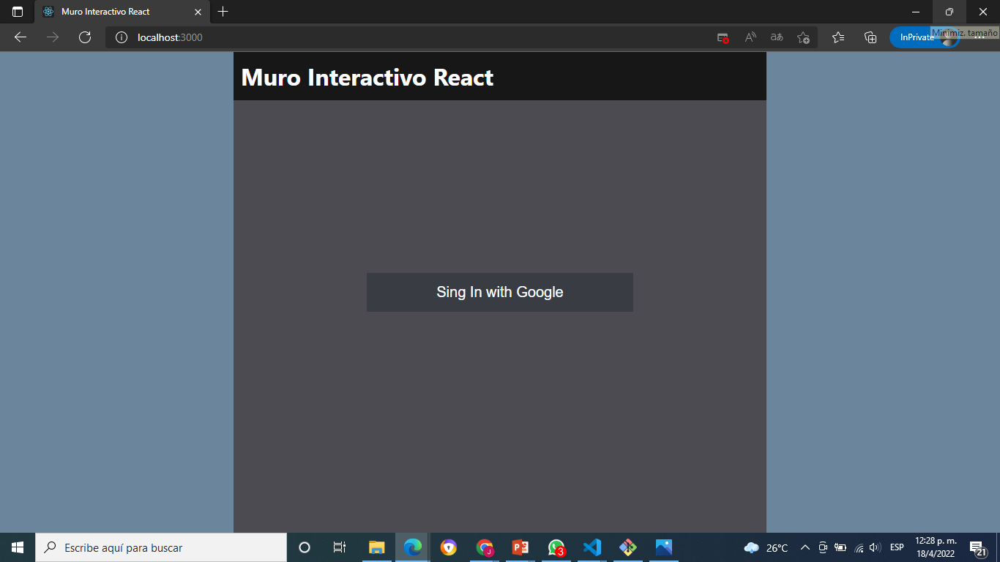
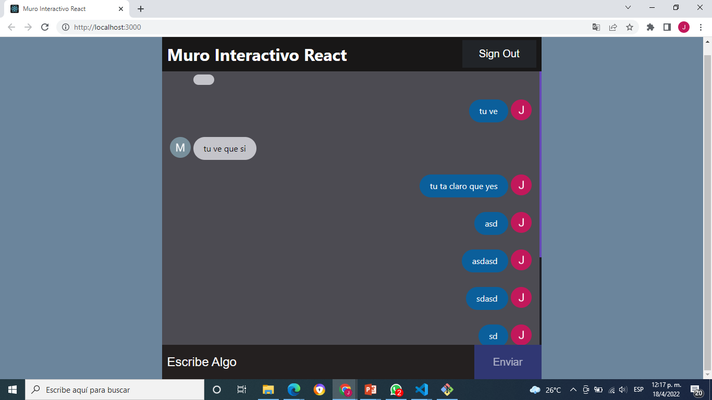

Proyecto Final (Programación WEB) Jorge Felipe Cabrera Severino (2020-10250)

Capturas

[Mi base de datos](BasedeDatos.png)

Instrucciones para correr el programa

1-Clonar el repositorio con **git clone**.  
2-Abra el codigo en su editor de texto de preferencia.  
3-En la terminal abra la carpeta con **cd nombre de la carpeta**. 
4-Use **npm install** para instalar los  nodos.  
5-Use **npm start** para iniciar la aplicaión react.  